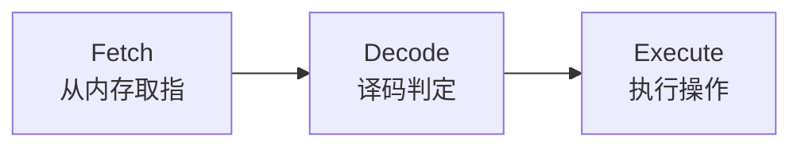

### 程序的运行
#### 指令与机器语言
- CPU 能执行的操作很基础（读/写、加减乘除等），理解的是机器语言（二进制指令）。
- 不同品牌/型号 CPU 的指令集不同。

#### 取指—译码—执行（FDE）循环

- 取指(Fetch): 从内存中读取下一条指令并载入到cpu
- cpu解码指令并确定应该执行的操作
- 执行对应操作

## 从机器语言到高级语言

- **汇编语言(Assembly language)**：用**助记符**（mnemonics）代替二进制；需**汇编器(Assembler)**翻译成机器码。
- **低级语言(Low-level language)**：贴近机器（如汇编）。
- **高级语言(High-Level language)**：更抽象、强大，易读易写、无需了解底层 CPU 细节（如 Python）。
**关键字（keywords）**、**运算符（operators）**、**语法（syntax）**共同构成语言规则，程序由**语句（statements）**组成。
