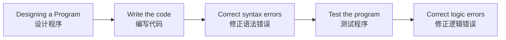

### 程序设计

#### 程序开发周期
- 设计程序 → 编写代码 → 修正语法错误 → 测试程序 → 修正逻辑错误

#### 设计（最重要的步骤）
- 理解需要完成的任务
- 与客户沟通，明确程序应完成的功能
- 提出问题，了解程序细节
- 创建一个或多个**软件需求**

#### 确定步骤 / 算法
- 将任务拆解为一系列步骤
- **算法**：执行任务所需的逻辑步骤集合

#### 伪代码（Pseudocode）
- 一种“假代码”，非正式语言，没有语法规则
- 不会被编译或执行
- 用于创建**模型程序**
- 有助于专注于程序设计，而不必担心语法错误
- 可以直接翻译成任意编程语言的代码

#### 流程图（Flowchart）
- 用图形方式表达程序步骤

- 常用符号：
  - 椭圆：开始/结束
  - 平行四边形：输入/输出
  - 矩形：处理过程
  
- 用箭头表示控制流

  
