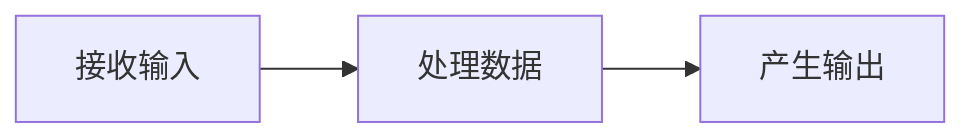

### 输入、处理与输出（IPO）
- 程序一般包含三步：


*输入：程序运行时接收的数据*

```python
print('Hello world')
# 输出: Hello world
```

- **函数 (function)**：执行某项任务的代码块

- **参数 (argument)**：传递给函数的数据

程序语句一般按**自上而下**顺序执行

```python
print('Programming')
print('is')
print('fun!')
# 输出：
# Programming
# is
# fun!
```
